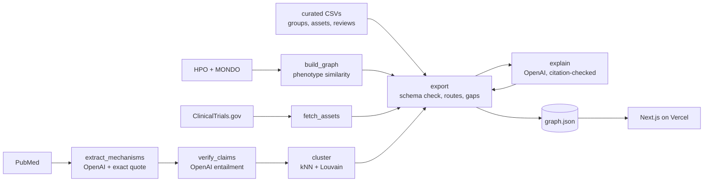

# Rare Disease Atlas

An evidence-backed atlas that connects rare diseases by biology, not by name, so patient groups find partners, shared studies and a next step.

**[Live demo](https://rare-disease-atlas.vercel.app)** · **[Methods](https://rare-disease-atlas.vercel.app/methods)** · **[10× case](https://rare-disease-atlas.vercel.app/10x)** · **Demo video** (link to be added) · **Challenge 05: OpenAI × Buffalo Initiative** (Hack-Nation, 7th Global AI Hackathon)

> Not medical advice. Research prototype. Links between diseases are hypotheses unless marked "supported".

<!-- screenshot: docs/img/home.png -->
<!-- screenshot: docs/img/stxbp1.png -->

## Try it in 60 seconds

1. Open the **[home page](https://rare-disease-atlas.vercel.app/)** and search **STXBP1** (or click "Start with STXBP1").
2. On the **[STXBP1 page](https://rare-disease-atlas.vercel.app/disease/OMIM_612164)**, read the short answer, then open **[Step 2](https://rare-disease-atlas.vercel.app/disease/OMIM_612164#shared)**. The SYNGAP1 card says "Both are included in the same study: STARR". Click any "evidence" chip to see the source and quote.
3. Open **[Step 4](https://rare-disease-atlas.vercel.app/disease/OMIM_612164#next)**: a ready-to-copy message to CURE SYNGAP1 with sources. Its route bar shows all four parts supported.
4. Try the honest gap: **[SCN1A / Dravet](https://rare-disease-atlas.vercel.app/disease/OMIM_607208)** has no patient group on file, says so, and suggests asking a study team. A same-gene counterexample: **[KCNQ2 DEE7](https://rare-disease-atlas.vercel.app/disease/OMIM_613720)** vs its benign form (BFNS1), with the evidence behind how they are grouped.

## At a glance

| What | Number |
|---|---|
| Diseases (8 severe DEEs, 3 benign same-gene forms, 1 contrast: SCN1A) | 12 |
| Genes | 9 |
| Symptoms (HPO terms) | 113 |
| Papers behind the claims | 366 |
| Verified mechanism claims (quote checked in the abstract) | 714, of which 393 state a direction and 321 are kept as context only |
| Studies (ClinicalTrials.gov, linked to a disease) | 63 |
| Curated assets, human-verified / total | 65 / 69 |
| Patient groups (all human-verified) | 15 |
| Shared-study links (all supported) | 3 |
| Supported routes | 4 of 12 diseases (the other 8 say "Route incomplete" and name the missing part) |
| Graph size | 748 nodes, 1,390 edges |
| Tests passing | 61 |

## Why you can trust it

1. **Exact quote.** An OpenAI model reads one PubMed abstract per call. Each claim must carry a quote that is a verbatim substring of the abstract, or it is dropped: 45 of 759 extracted claims (5.9%) were dropped; 714 kept from 487 abstracts.
2. **Does the quote say it?** A second OpenAI call sees only the gene, the claimed effect and the quote. Of 506 directional claims, 362 were "yes", 32 "partial" and 112 "no". "No" claims become context only and are not counted as evidence.
3. **Two human reviewers.** Varduhi and Amin judged 24 random claims (correct / partial / incorrect). Precision by confidence tier: **0.8: 4 of 8 correct** (+4 partial); **0.7: 7 of 8** (+1 partial); **below 0.7: 0 of 3** (+2 partial, 1 incorrect, which was demoted). Five more sampled claims were already context only; reviewers checked those demotions (1 correct, 4 partial). Agreement between the two reviewers: 14 of 24 (58%), Cohen's κ 0.32. A small sample: a first check, not a measured rate.
4. **Verified groups and assets.** All 15 patient groups and 65 of 69 assets were checked by a person (Varduhi). Only verified rows can make a route "supported".

Every link shows its source, confidence and status. Hypotheses are labeled as hypotheses. Details: [Methods](https://rare-disease-atlas.vercel.app/methods).

## How it answers the brief

| Brief requirement | Status | Where |
|---|---|---|
| Module 1: nodes for diseases, genes, mechanisms, symptoms, patient groups, papers, studies, assets | **Partial** | 12 diseases, 9 genes, 25 mechanisms, 113 symptoms, 15 groups, 366 papers, 63 studies, 64 assets, 81 investigators. **No variant-level nodes, no ClinVar.** |
| Module 1: names, stable IDs, source + date + confidence per relationship | **Pass** | Search resolves MONDO/HPO synonyms (type EIEE4 in the home search); IDs are OMIM, MONDO, HP, PMID, NCT. Every edge has source, references, retrieved date, confidence and status (schema-checked). |
| Module 1: funding (NIH RePORTER) | **Not included** | Marked "Not included in this prototype" in each disease's "Sources searched". |
| Module 2: source shown; observed vs inferred; contradictions; honest "no supported route" | **Pass** | Evidence drawer on every chip ([STXBP1](https://rare-disease-atlas.vercel.app/disease/OMIM_612164)); [SCN1A](https://rare-disease-atlas.vercel.app/disease/OMIM_607208) shows coverage and what is missing. |
| Module 3: mechanistic overlap | **Partial** | [Map](https://rare-disease-atlas.vercel.app/explore): similarity = phenotype + variant effect. Molecular function is assigned from the gene, so that half is a gene-family signal. |
| Module 3: shareable assets | **Pass** | Step 3 of each disease page; shared studies in Step 2. |
| Module 3: network overlap | **Partial** | Lead authors who appear on papers about 2+ genes (81; labeled "possible match" unless ORCID or affiliation agree), shown in the Detailed view and on [mechanism pages](https://rare-disease-atlas.vercel.app/mechanism/loss_of_function--potassium_channel). No funders or biotech. |
| UX: low ink, one global search, progressive reveal, every edge explained | **Pass** | One search on the home page; Simple / Detailed toggle; evidence drawer. |
| Patient action view | **Pass** | Steps 3–4: route bar (four parts), message to copy, print summary, "needs expert review". |
| The three questions | **Pass** | Who shares: Step 2. What exists: Step 3. What to do together: Step 4. |
| What Good Looks Like (Maria's path) | **Pass** | The 60-second path above. |
| 10× moonshot | **Pass** | [/10x](https://rare-disease-atlas.vercel.app/10x). |

## Built with OpenAI

| Brief use | Where | How |
|---|---|---|
| **Extract** | `pipeline/extract_mechanisms.py` | Structured outputs return claims with a quote; exact-span check drops unverifiable ones. `pipeline/verify_claims.py` adds the entailment check. |
| **Explain** | `pipeline/explain.py`, `web/lib/explain.ts`, `web/app/api/explain/route.ts` | Plain-language explanation of each route. Every step must cite edge IDs from that route; invented identifiers are rejected, then retried once, then replaced by a template. The live route is server-side and rate-limited. |
| **Reconcile** | `pipeline/search_index.py`, MONDO/HPO files | **Deterministic**: synonyms come from MONDO and HPO, not from a model. OpenAI only maps the disease named in an abstract onto one of that gene's disease nodes during extraction. |

The model comes from `OPENAI_MODEL` (currently `gpt-5.4-mini`); nothing is hard-coded.

## The 10× case in one paragraph

Finding and connecting related communities, registries and studies: **well over 10×** (measured: about 2 hours for 8 genes by one team member, versus seconds on the Atlas). Launching a shared study: **about 1.3×** (an estimate, because ethics approval, start-up and recruitment dominate). The biggest win may be joining an existing study such as STARR. Sources, assumptions and what to validate next: [/10x](https://rare-disease-atlas.vercel.app/10x).

## Architecture



Every PubMed, ClinicalTrials.gov and OpenAI call is cached by key (`data/cache/`, not committed).

## Setup and reproduce the dataset

```bash
python3 -m venv venv && . venv/bin/activate && pip install -r requirements.txt
cp .env.example .env     # OPENAI_API_KEY, OPENAI_MODEL (required for extraction/explanations); NCBI_EMAIL, NCBI_API_KEY (optional)
make data                # HPO + MONDO release files -> data/raw
make graph               # full pipeline -> data/graph/ and web/public/data/
make test                # 61 tests
(cd web && npm install)
make dev                 # app on http://localhost:3000
```

The committed `data/graph/` is enough to run the app without any API key. A from-scratch `make graph` calls PubMed, ClinicalTrials.gov and OpenAI (nothing is cached in the repo). A test fails if the committed clusters are stale against a rebuild.

## Data sources and licenses

| Source | What we use | License / terms | Retrieved |
|---|---|---|---|
| Human Phenotype Ontology | diseases, genes, symptoms, information content | HPO license (free, cite) | 2026-10-03 |
| MONDO | disease IDs, synonyms | CC BY 4.0 | 2026-10-03 |
| PubMed (NCBI E-utilities) | abstracts (only short verified quotes stored), author lists | NLM terms; abstracts © publishers | 2026-10-04 |
| ClinicalTrials.gov API v2 | studies | public domain | 2026-10-04 |
| OpenAI API | extraction, entailment check, explanations | OpenAI terms | 2026-10-04 |
| `data/curated/*.csv` | patient groups, assets, review verdicts (human-verified) | team-curated, dated | 2026-10-04 |

Details: [DATA_SOURCES.md](DATA_SOURCES.md). NIH RePORTER is not used.

## Known limitations

- **An 8-gene focused slice** (as the brief suggests: "Begin with a focused slice"), plus 3 benign counterexamples and SCN1A as a contrast.
- **No funding or RePORTER data**, and no variant-level nodes.
- **Molecular function is derived from the gene**, so the function half of the similarity is a gene-family signal.
- **Precision at the highest confidence tier is modest** (4 of 8 correct in a 24-claim sample); reviewer agreement is κ 0.32.
- **Similarity links are hypotheses.** Only links backed by a verified shared study are "supported".
- Disease-level evidence for the benign SCN2A and SCN8A forms is thin (about one directional claim each); the app reports that as a finding.

<details><summary>Curated CSV formats and the verification protocol</summary>

Files in `data/curated/` (a missing file just shows as a gap):

```
patient_groups.csv:  gene,organization_name,url,country,has_registry,registry_url,date_checked,notes,verified,verified_by,verified_at
assets.csv:          gene,asset_type,name,identifier,source_url,status,date_checked,notes,verified,verified_by,verified_at
evidence_review_v2.csv: edge_id,gene,claim,quoted_span,pmid,about_this_gene,same_mechanism,human_patients,verdict,notes,verified,verified_by,verified_at,second_verdict,second_by,final_verdict
```

Only `verified=yes` rows count as human-verified; unverified rows show as "pending verification" and cannot make anything "supported". Precision uses `final_verdict` per confidence tier. [docs/review_packet.md](docs/review_packet.md) is the reading aid the reviewers used; checklists are in [docs/verification/](docs/verification/).
</details>

<details><summary>Deploy (Vercel)</summary>

Root directory `web`. Server-side env vars `OPENAI_API_KEY` and `OPENAI_MODEL` only power the live "explain this link" button; without them it is hidden and every page still shows its pre-generated explanation.

```bash
cd web && vercel deploy --prod
```
</details>

## Team

- **Amin Zayeromali**: technical lead (pipeline, app, evidence checks).
- **Varduhi Nshanyan**: curation (patient groups, assets), evidence review and the 10× case.

Decisions and dead ends: [docs/DECISIONS.md](docs/DECISIONS.md). Tech video notes: [docs/TECH_VIDEO_NOTES.md](docs/TECH_VIDEO_NOTES.md).
