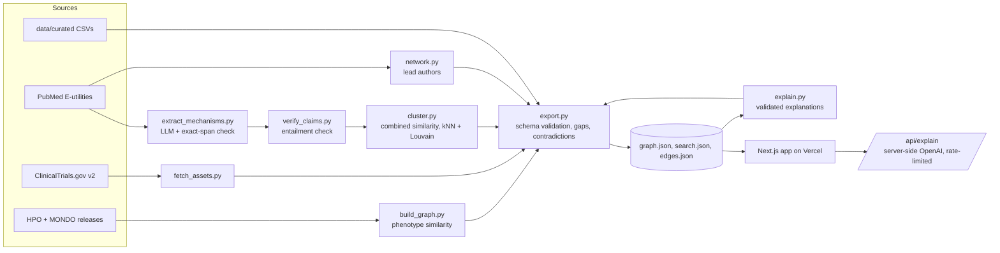

# Rare Disease Atlas

Evidence-backed knowledge graph that connects rare diseases by **mechanism and phenotype**, not by name, so a patient-group leader can go from *her disease* → *a supported or hypothesised connection* → *what already exists (groups, registries, studies)* → *one sourced next step*. When no supported route exists it says so and shows what evidence is missing. Hack-Nation 7th Global AI Hackathon, Challenge 05 (OpenAI × Buffalo Initiative).

> **Not medical advice.** Research prototype. Computed similarity is a hypothesis, never evidence of shared mechanism.

Live app: https://rare-disease-atlas.vercel.app · Methods page: `/methods` · Roadmap: `docs/PLAN.md` · Decisions and dead ends: `docs/DECISIONS.md`

## Problem and users
Rare diseases are many, small and scattered. A parent who leads a patient group for one gene rarely knows that another group, registry or study already works on the same biology under a different name. The Atlas is built for **Maria**, a non-expert patient-group leader, and for **Dr. Osei**, a researcher who asks "who works on my mechanism under other gene names?".

Slice (do not expand without asking): 8 developmental & epileptic encephalopathy genes (STXBP1, SCN2A, SCN8A, KCNQ2, KCNT1, SYNGAP1, CDKL5, GNAO1), 3 benign same-gene counterexamples (SCN2A-BFIS3, SCN8A-BFIS5, KCNQ2-BFNS1) and 1 contrast (SCN1A Dravet). Defined in `pipeline/config.py`.

## The journey (what the app shows)
1. **Home:** one search over diseases (with MONDO synonyms), genes, symptoms (HPO terms and synonyms), mechanisms and patient groups, plus the map of all diseases.
2. **Disease page, 4 steps:** *Your disease* (plain-language summary) → *Who shares your biology* (related diseases with a one-line why and a status chip) → *What already exists* (patient groups, registries, studies; gaps say what would make a route "supported") → *Your next step* (one sourced action and what needs expert review).
3. **Evidence drawer:** every chip opens a slide-over with relation, source, quote from the paper, entailment verdict, confidence, contradictions and PMID links.
4. **Map (`/explore`):** force-directed graph; colour = route status, dashed = hypothesis, dashed pink ring = uncertain grouping.
5. Researcher view = `/mechanism/<effect>--<function>`; investigators are shown as "possible match" unless ORCID or affiliation agree.

Badge meaning: green *supported* (database, or a quote that really states it), amber dashed *hypothesis* (computed), pink *conflicting evidence / expert review*, grey *context only*, cyan = interactive.

## Architecture

Everything is cached by key in `data/cache/`, so `make graph` is idempotent and never re-calls an API on rerun.

## Setup
```bash
python3 -m venv venv && . venv/bin/activate && pip install -r requirements.txt
cp .env.example .env        # OPENAI_API_KEY, OPENAI_MODEL (required for extraction); NCBI_EMAIL, NCBI_API_KEY optional
cd web && npm install
```
`NCBI_API_KEY` empty means the `api_key` parameter is omitted and requests are throttled to 3/s (10/s with a key). The OpenAI model always comes from `OPENAI_MODEL`; nothing is hard-coded.

## Reproduce the dataset
```bash
make data     # HPO (hp.obo, phenotype.hpoa, genes_to_disease.txt) + MONDO -> data/raw (gitignored)
make graph    # base graph -> trials -> mechanisms -> entailment check -> clustering -> authors -> export -> explanations -> export
make test     # pytest (34 tests)
make dev      # web app on http://localhost:3000
```
The base graph is 12 diseases and ~250 HPO edges; the full graph adds trials, verified mechanism claims, computed links, investigators and explanations. Steps that need OpenAI are skipped with a notice if the key is missing.

## Evidence pipeline (why you can trust an edge, and how far)
Every edge has `id, source, target, relation, evidence_type, source_db, references[], retrieved_at, confidence, status`; `evidence_type` ∈ curated | computed | llm_extracted | manual and `status` ∈ supported | contradicted | hypothesis (validated with pydantic on export).
1. **Extraction.** An LLM reads one PubMed abstract and returns claims (variant effect × molecular function, disease context restricted to that gene's diseases, population, quoted span).
2. **Exact-span check.** The span must be a verbatim substring of the abstract (whitespace-normalised) or the claim is dropped. Proves the words exist.
3. **Entailment check.** A second call sees *only* the gene, the claimed effect and the span and says whether the span states the effect (yes / partial / no) and which population it describes. "No" turns the claim into context only; "partial" lowers confidence by 0.2.
4. **Human review.** `python pipeline/make_review_v2.py` draws 24 random claims (8 per confidence tier). Fill `verdict` (`correct` | `partial` | `incorrect`) in `data/curated/evidence_review_v2.csv`; the app then shows precision **per tier** and a "manually verified" badge.
5. **Explanations** are written by an LLM from a route's edges only. Every step must cite edge ids from that route, no PMID/NCT/OMIM/HP/MONDO identifier may appear that is not in the input, and a step asserting a loss- or gain-of-function effect must cite a claim whose span entails it. A failed answer is retried once, then replaced by a template.
6. **Computed links** (phenotype similarity, mechanism overlap, clusters, routes) are always labelled hypotheses. "Supported" routes need a curated shared patient group or asset.

## Curated data (all files optional; missing file = shown as a gap)
`data/curated/patient_groups.csv`
```
gene,organization_name,url,country,has_registry,registry_url,date_checked,notes
```
`data/curated/assets.csv`
```
gene,asset_type,name,identifier,source_url,status,date_checked,notes
```
`data/curated/evidence_review.csv` (v1 priority sample, not used for precision) and `evidence_review_v2.csv`
```
edge_id,gene,claim,quoted_span,pmid,about_this_gene,same_mechanism,human_patients,verdict,notes
```
Partial files are fine: rows without `gene` and a name, or naming a gene outside the slice, are skipped and counted; a `gene` cell may list several genes separated by `;`. Never enter a URL or organization you have not verified. Run `make graph` and routes light up.

## Deploy (Vercel)
Project root directory: `web`. Environment variables (server-side only): `OPENAI_API_KEY`, `OPENAI_MODEL`. They only power the live "explain this link" button and `POST /api/explain`; without them `GET /api/explain` reports `{live:false}`, the button is hidden, and every page still shows its pre-generated explanation.
```bash
cd web && vercel link && vercel deploy --prod
```

## Limitations
- Abstracts only; claims often name a gene but no disease, so disease-level evidence is thin, especially for the benign forms (SCN2A and SCN8A have about one directional claim each). That gap is reported, not hidden.
- The entailment check sees only the quoted span; most spans do not state a population. Both LLM steps can be wrong; the review sample is the check on them.
- Confidence tiers, the 0.6/0.4 similarity weights and the ≥ 3 claim and ≥ 2 PMID thresholds are judgement calls (see `docs/DECISIONS.md`).
- Trials are matched by gene symbol; a human must confirm disease and variant scope. NIH RePORTER is not searched yet.
- With no curated patient groups or assets loaded, no route can be "supported". Investigator identity is only confirmed by ORCID or affiliation.
- The 10× page (`/10x`) is an empty slot awaiting content.

## Data sources and licenses
| Source | Used for | Terms |
|---|---|---|
| Human Phenotype Ontology (hp.obo, phenotype.hpoa, genes_to_disease.txt) | diseases, genes, phenotypes, information content | HPO licence: free, cite |
| MONDO | disease cross-references and synonyms | CC BY 4.0 |
| PubMed / NCBI E-utilities | abstracts (only short verified quotes + PMID are stored), author lists | NLM terms; abstracts © publishers |
| ClinicalTrials.gov API v2 | study nodes | public domain |
| OpenAI API | claim extraction, entailment check, explanations | OpenAI terms |
| `data/curated/*.csv` | patient groups, assets, manual review | team-curated, dated |
Retrieval dates are in `graph.json` `meta.sources`. Full list: `DATA_SOURCES.md`.
